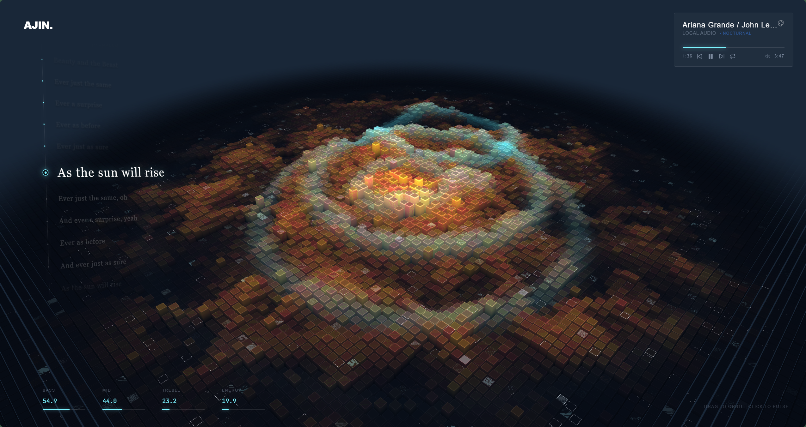

# Sonic Topography

[中文](./README.md) | English

Sonic Topography is a local music visualizer built with React, Three.js, Vite, Web Audio, and a local proxy server. It turns music frequency bands into a glowing 3D terrain with waves, ripples, meteors, lyrics, and themeable visual effects.

> Usage restriction: this project is provided only for learning, research, and personal non-commercial use. Without explicit permission from the author, it may not be used for commercial projects, commercial performances, commercial displays, paid services, resale, or any profit-making purpose.



## Features

- Audio-reactive 3D terrain with ripples, glow, and meteor effects.
- Local audio playback with optional `.lrc` lyrics.
- Built-in demo track.
- System audio capture for driving the visualizer with any audio playing on the computer.
- Netease Cloud Music search with playable-result filtering.
- Netease liked songs, playlists, and daily recommendations after saving a valid Cookie.
- Local playlists with persistence.
- Custom themes, theme rotation, visual Ground EQ, Pulse triggers, and Meteor triggers.
- Preset import/export for moving settings across devices.
- Windows single-EXE build. End users do not need Node.js or Go to run the generated EXE.

## Interface Guide

### AJIN.

Click `AJIN.` in the top-left corner to open the side rail. On the first visit, the app shows a subtle hint:

```text
Click AJIN. in the top-left corner to open the side rail
or move the mouse to the left edge
```

After the side rail has been opened once, the hint is hidden for that browser.

### Side Rail

The side rail contains the main actions:

- `Visual`: close panels and return to the visualizer.
- `Settings`: open visual and account settings.
- `Search`: search music.
- `Netease`: appears after a valid Cookie is saved; opens liked songs, playlists, and daily recommendations.
- `Playlist`: open local saved playlists.
- `Demo`: play the built-in demo.
- `Upload`: choose local audio and `.lrc` files.
- `Capture`: capture system audio.
- `Fullscreen`: enter or exit browser fullscreen.

### Player Card

The player card in the top-right shows the current track, source, theme, progress, playback controls, volume, and duration. It can be hidden from the Custom Theme settings.

### Lyrics

When LRC lyrics are available, they are displayed on the left side. The current line is highlighted. Lyrics are hidden during system audio capture because capture mode has no known track lyrics.

### Frequency Stats

The bottom-left stats show the current Bass, Mid, Treble, and Energy values so you can see which audio bands are driving the visualizer.

## Settings Guide

Open the side rail by clicking `AJIN.`, then click `Settings`.

### Preset Migration

The top area of Settings contains import/export controls:

- `Export Preset`: downloads a JSON file containing themes, Ground EQ, triggers, local playlists, and related settings.
- `Import Preset`: imports a JSON preset and applies it to the current browser.
- `Include Netease Cookie`: off by default. The Cookie is exported only if you explicitly enable it.

Treat exported Cookies as sensitive login data.

### Pulse Effect

Controls pulse waves triggered by clicks or audio. You can tune the trigger band, threshold, intensity, and cooldown.

### Meteor Effect

Controls meteor-like visual effects. You can tune the trigger band, intensity, amount, spacing, and cooldown.

### Ground EQ

This is a visual EQ. It does not change the audio. It only changes how the terrain reacts:

- Left side: low frequencies, center lift, kick and bass impact.
- Middle: flowing terrain waves and broad motion.
- Right side: spikes, sparkles, edge shimmer, and tiny high-frequency details.

While music is playing, the EQ canvas shows a live spectrum guide behind the editable curve.

### Custom Theme

You can save multiple custom themes. Each theme includes:

- Background color.
- Cool color.
- Warm color.
- Accent color.
- Glow intensity.
- Auto-rotation speed.
- Player card visibility.

Custom themes can be saved and deleted. The top-right theme button still cycles through built-in themes; to use a custom theme, select it in Settings.

### Netease Cookie

This section stores a manually copied Netease Cookie. After saving a valid Cookie, the `Netease` entry appears in the side rail.

The Cookie is stored in the current browser localStorage and synced to the local proxy memory at runtime. It is not written into the project config.

## Netease Cookie Tutorial

This app does not read your Netease password and cannot automatically read official-site Cookies. Each user must manually copy their own browser Cookie.

Recommended desktop steps:

1. Open Settings, then open `Netease Cookie`.
2. Click `Open Official Site` and log in at `music.163.com`.
3. Press `F12`. If it does not work, try `Fn + F12` or `Ctrl + Shift + I`.
4. Open the `Network` tab.
5. Refresh the Netease page, or play/search a song.
6. Search for `weapi`. If nothing appears, search for `music.163.com`.
7. Click a request.
8. Open `Headers`.
9. Find `Cookie` under `Request Headers`.
10. Copy the complete Cookie value.
11. Paste it into Sonic Topography and save.

After saving a valid Cookie:

- Search uses your account permission to filter playable songs.
- The side rail shows `Netease`.
- You can open liked songs, playlists, and daily recommendations.

If the Cookie is invalid, it is usually incomplete, expired, logged out, or temporarily rejected by Netease.

## Run From Source

Install Node.js first.

```powershell
npm install
npm run dev
```

Open:

```text
http://127.0.0.1:3000
```

## Local Production Server

```powershell
npm run build
npm start
```

Open:

```text
http://127.0.0.1:4173
```

## Windows One-Click Script

After downloading or cloning the repository, double-click:

```text
start-sonic-topography.bat
```

This script installs dependencies if needed, builds `dist/`, starts the local production server, and opens `http://127.0.0.1:4173`. This mode requires Node.js on the computer.

## Windows Single EXE Build

Developers need Node.js and Go to build the EXE. End users do not need Node.js or Go to run the generated EXE.

```powershell
npm install
npm run build:go-exe
```

Output:

```text
SonicTopography.exe
```

Double-clicking the EXE starts the local server and opens the default browser.

The EXE always uses `http://127.0.0.1:4173`. If Sonic Topography is already running on that port, it opens the existing page. If another program is using the port, close that program first.

## macOS Build

You can cross-compile macOS binaries from Windows:

```powershell
$env:CGO_ENABLED='0'
$env:GOOS='darwin'
$env:GOARCH='arm64'
go build -o dist-mac/SonicTopography-macos-arm64 ./cmd/sonic-topography
$env:GOARCH='amd64'
go build -o dist-mac/SonicTopography-macos-amd64 ./cmd/sonic-topography
```

Use `arm64` for Apple Silicon Macs and `amd64` for Intel Macs. These binaries are not Apple-signed or notarized, so macOS may require right-click Open or manual approval in Privacy & Security.

## Wallpaper Engine

```powershell
npm run build:wallpaper
```

The generated `dist-wallpaper/` folder can be imported as a Wallpaper Engine web wallpaper.

## Local Data

- Themes, triggers, Ground EQ, Netease Cookie, and most settings are stored in browser `localStorage`.
- When running from source, local playlists are saved through `/api/playlists` into `data/playlists.json`, with browser localStorage as a fallback.
- When running the Go EXE, playlists are stored in the user's config directory, for example `%APPDATA%/SonicTopography/playlists.json` on Windows.
- Real uploaded audio files are not exported in preset files and are not bundled into the EXE.

## Useful Commands

```powershell
npm run lint
npm run build
npm start
go test ./...
npm run build:go-exe
```

## Notes

- This project is for learning, research, and personal non-commercial use only. Commercial use is not permitted.
- Netease playback uses web endpoints and may be affected by copyright, membership, region, or account state.
- Search results show only songs playable under the current anonymous state or current Cookie permissions.
- Cookies are sensitive login credentials. Do not share your own Cookie.
- Do not commit `dist/`, `dist-mac/`, `dist-wallpaper/`, `SonicTopography.exe`, or local `data/`.
